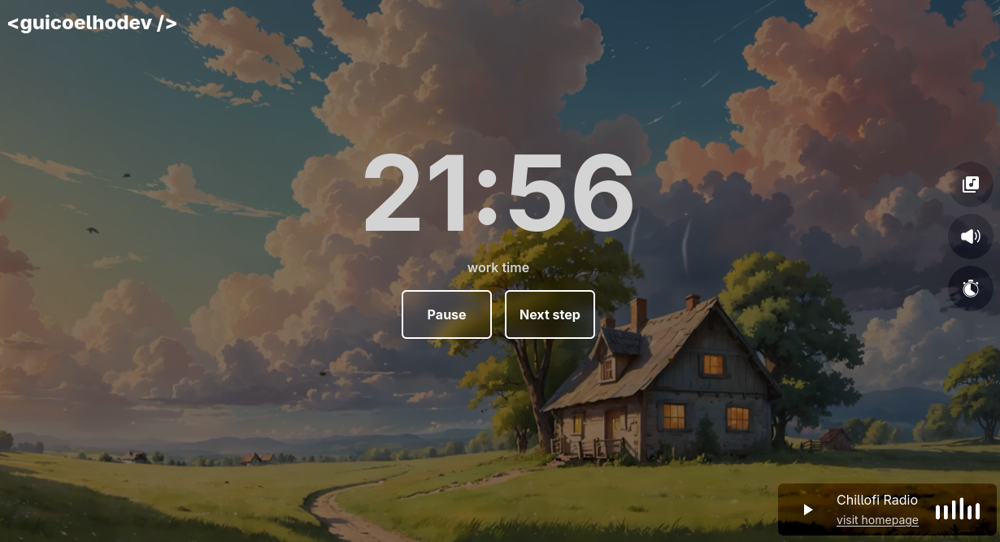

 

<h3>Stay calm and relax</h3>

Want to see the app? <a target="_blank" href='https://radio.guicoelhodev.com'>click here</a>

 

This project is a complete <b>Pomodoro application</b> combined with <b>radio streaming</b>. Stay focused while enjoying great music — no login or setup required.

This project was only possible thanks to the use of the <a href="https://www.radio-browser.info/" target="_blank">Radio Browser API</a>. Check them out to see more information about their <b>open source service</b>.

<b>Made with ❤️ by
<a href="https://www.linkedin.com/in/guicoelhodev/" target="_blank">
guicoelhodev
</a>
</b>
